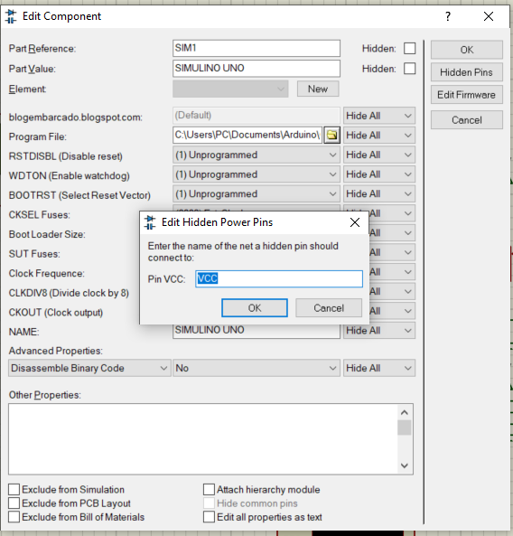
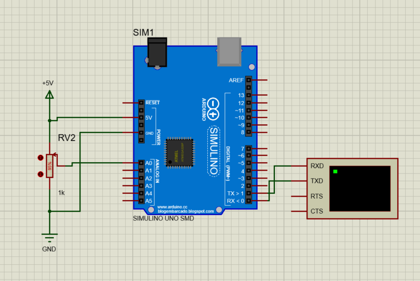
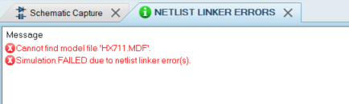
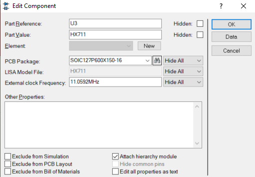

# Proteus library collection
A collection of library for Arduino - Proteus Simulation

***
### Board
* Collection Arduino Board
* Arduino UNO
* Arduino NANO
* Arduino MINI
* Arduino PRO-MINI
* Arduino MEGA1280
* Arduino MEGA2560
* Arduino Genuio
* Arduino Lilypad
* NodeMCU ESP8266 (No Simulation)

***
### Component
* C945 Transistor

***
### Module
* DS1307 RTC Module

***
### Output
* LCD Display (16X2, 20X4)

***
### Power
* CR2032 Batteries 
* L298 Motor Driver
* Lipo Batteries
* Single Cell Batteries
* OctoCoupler
* Solar Panel

***
### Sensor
* Analog Flex Sensor
* Analog Vibration Sensor
* Capacitive Touch Sensor
* DHT Sensor
* Flame Sensor
* Flex Sensor
* HeartBeat Sensor
* Gas Sensor (MQ2-MQ9)
* Gas Sensor (MQ135)
* IR Proximity Sensor
* IR Sensor
* IR Tracking Sensor
* HX711 Load Cell Sensor
* Magnetic Hall Effect Sensor
* Magnetic Reed Switch Sensor
* PH Sensor
* Passive IR (PIR) Sensor
* Piezo Electric Sensor
* Rain Sensor
* Soil Moisture Sensor
* Ultrasonic Sensor
* Vibration Sensor
* Water Level Sensor
* Water Flow Sensor (Project)

***
### Wireless
* Bluetooth
* GPS
* GSM
* NRF24L01
* RF
* XBee

***
## How To Install
1. Unzip files
2. Copy and Paste Files with extension .IDX .LIB .HEX to LIBRARY folder in Proteus
3. Copy and Paste Files with extension .STP ti MCAD folder in Proteus 
4. Restart Proteus

_For LIBRARY and MCAD folder by default at C:\ProgramData\Labcenter Electronics\Proteus 8 Professional_

***
### Want to help?
If you have library of the component that you want to add, you're warmly welcome to contribute. Just by follow simple step below:

1. Fork the Repository
2. Add your new libary
3. Issue a Pull request
_Better if the library already package as 'Name_Component-V1-S0'_

V _X_ : Version of files/component
S _X_ : Sourse of files (S1 as link below, S0 from other place in the intenet)

I will update as soon as possible. Any contribution is welcome as many sensor is not available in Proteus

***
## Some Bug and Fixed

### Analog input stuck at 1023
- Sometimes analog input stuck at 1023 when using LDR or Resistor.
- <figure><figcaption></figcaption></figure>
- Enable hidden pin on Arduino
- <figure><figcaption></figcaption></figure>
- Ensure VCC(Arduino) and +5V, GND(Arduino) and GND(Normal)is connected together

### Cannot find model file .MDF
- <figure><figcaption></figcaption></figure>
- Example Error
- <figure><figcaption></figcaption></figure>
- Enable Attach hierarchy module on problem component

***
#### Credits & Main Source:
* https://www.theengineeringprojects.com/
* https://github.com/Kalebu/Proteus-arduino-libraries
* https://github.com/tecsantoshkumar/Proteus_Library
* https://github.com/tueuer/PROTEUS-LIBRARY

_Disclaimer: I am not author of the files. I just collect files across internet and put here at one place. Many sites are scam and plain lying so it make harder to find correct files. Any watermark is not removed only filename is change to follow name-scheme_

